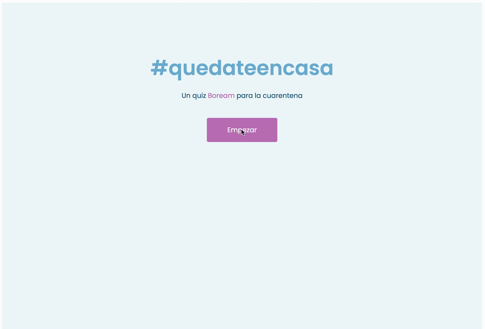

---

# svelte demo quiz app



Esta app es un cuestionario simple construido con Svelte para mostrar su funcionamiento y hacer un repaso de algunas de sus características:

* Sintaxis y operadores lógicos para construir templates
* Componentización de una interfaz
* Encapsulación de estilos
* Ciclo de vida de componentes
* Comunicación entre componentes
    * Pasar propiedades a un hijo
    * Emisión de eventos desde un hijo
* Propiedades reactivas
* Manejo de eventos
* Uso de Slots
* Uso de transiciones y animaciones incluidas en Svelte
* Etiquetas especiales (ej: `<svelte:head>`)

## Cómo empezar

Instalar las dependencias...

```bash
cd svelte-app
npm install
```

...y ejecutarlo [Rollup](https://rollupjs.org):

```bash
npm run dev
```

En tu navegador en la dirección [localhost:5000](http://localhost:5000) podrás ver la app en funcionamiento. Edita cualquier componente en `src/components` y guárdalo para ver cómo se recarga y se muestran los cambios.
